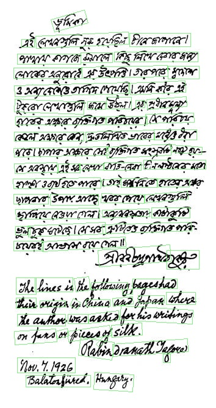

# Bn_hanwritten_text_detection
The DBnet model was trained by my custom Bangli handwritten or Font image dataset to Bangli text word.

# Dependency
- python == 3.6
- torch == 1.4.0
- pytorch 1.1.0
- torchvision == 0.5.0
- pyclipper
- colorlog 
- polygon3 
- opencv-python
# Data structure

Convert the vgg annotation into 8 coordinate.

so the txt file annotation like this,
```
x,y,w,h convert below coordinate
x1,y1,x2,y2,x3,y3,x4,y4 = x,y,x+w,y,x+w,y+h,x,y+h
```
# Data Preparetion

Go datasets folder and run ```data_preprocess.py```. it generate individual txt file corresponding to each image.
like as,
```
datasets
├── test.txt
├── train
│   ├── gt
│   │   └── 11b2e8556cc7f36da563dfafc447f4da.txt
│   └── img
│       └── 11b2e8556cc7f36da563dfafc447f4da.jpg
├── train.txt
└── val
    ├── gt
    │   └── 3648c8fb0771c3dd91fd3321b70bc0ca.txt
    └── img
        └── 3648c8fb0771c3dd91fd3321b70bc0ca.jpg
```
then run ```get_txt.py``` it generate train.txt and text.txt list.

After generate ```train.txt``` and ```test.txt``` list modify the ```config.json``` file line 9 and 15.
```
"train_data_path": [
                    [
                        "./datasets/train.txt"
                    ]
                ],
                
  
and

 "val_data_path": "./datasets/test.txt", 
```
# Traning
Run,
```
train.py

```

# Inference
For Single test dowload [pretrain model](https://drive.google.com/file/d/1AwieLtflhmCk2cOYCJA6VztvqhW44FFX/view?usp=sharing).Make sure the pretrain model path.
And Run,
```
predict.py

```
# Test Result



PyTorch re-implementation of Real-time Scene Text Detection with Differentiable Binarization

Following this git
- [SURFZJY](https://github.com/SURFZJY/Real-time-Text-Detection)
- [MhLiao](https://github.com/MhLiao/DB)
- [WenmuZhou](https://github.com/WenmuZhou/DBNet.pytorch)


